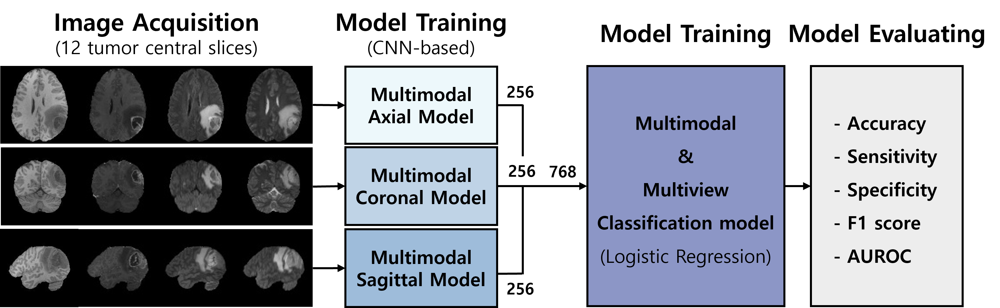
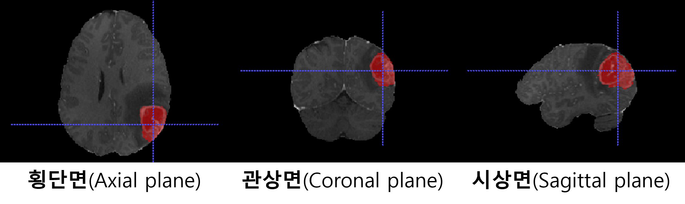
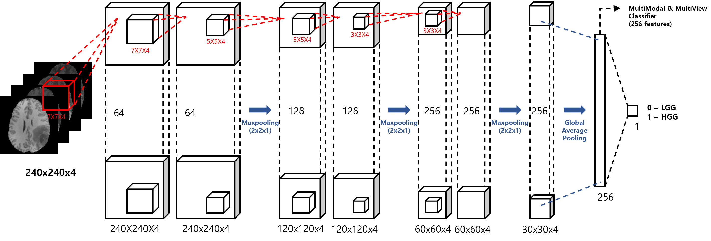
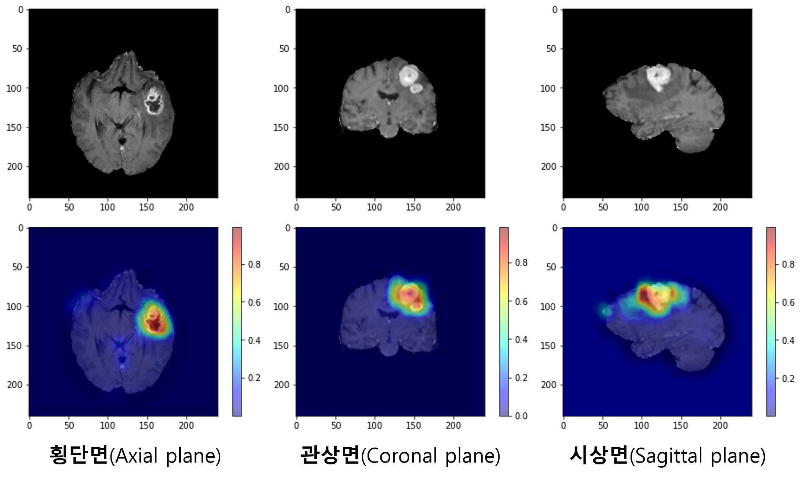

# MmMv
Deep MultiModal MRI Fusion Model for Brain Tumor Grading

 

## 1. Introduction
Glioma is a type of brain tumor that occurs in glial cells and is classified into two types: high grade glioma(HGG) with a poor prognosis and low grade glioma(LGG).

 

We developed a `Multimodal & Multiview (MmMv)` model that applied input-level fusion to MRI of four modalities (T1, T1Gd, T2, T2-FLAIR) for glioma grading.

 

 

## 2. Materials & Methods
### **Dataset**
Brain Tumor Segmentation Challenge (BraTS) 2020
- Training set : 248 subjects (HGG 197, LGG 51)
- Test set : 121 subjects (HGG 96, LGG 25)

 

 

### **Multimodal model**
Trained for axial, coronal, and sagittal planes respectively. 

 

 

## 3. Results

### **Classification Performances** 

| |Accuracy|Sensitivity|Specificity|F1 Score|AUC|
|:---:|:---:|:---:|:---:|:---:|:---:|
|Axial|0.9008|0.9479|0.7200|0.9381|0.8340|
|Coronal|0.9256|0.9063|1.000|0.9531|0.9508|
|Sagittal|0.8595|0.8750|0.8000|0.9081|0.8375|
|`MmMv`|0.8926|0.9688|0.6400|0.9347|0.9467|

 

### **CAM results of multimodal model**

 

 